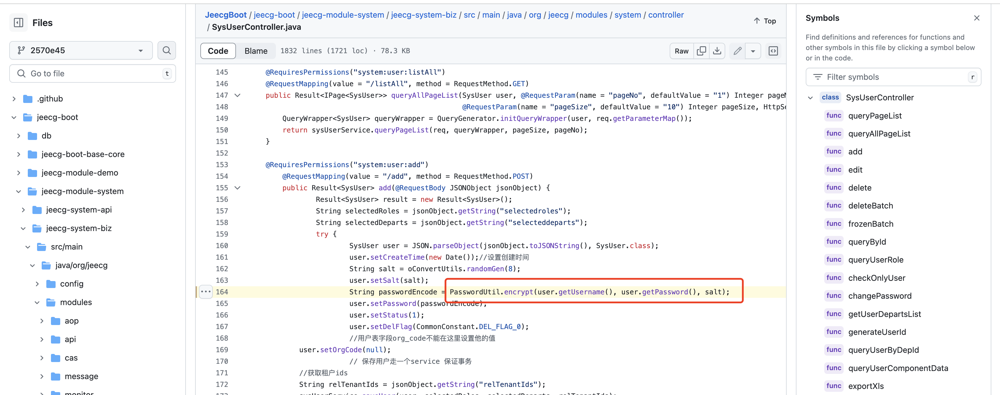
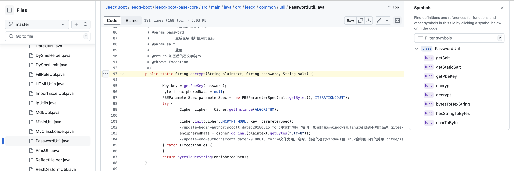
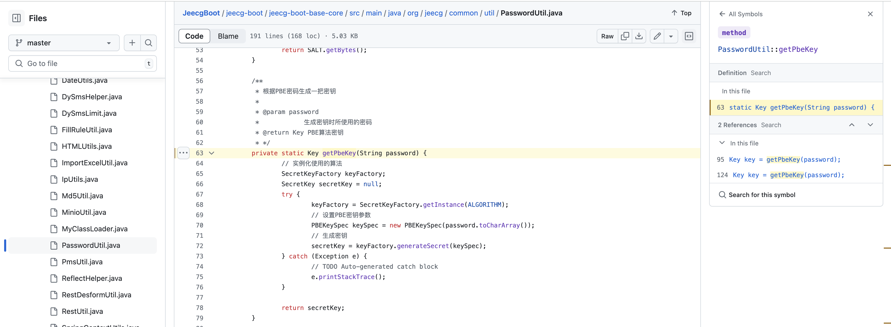
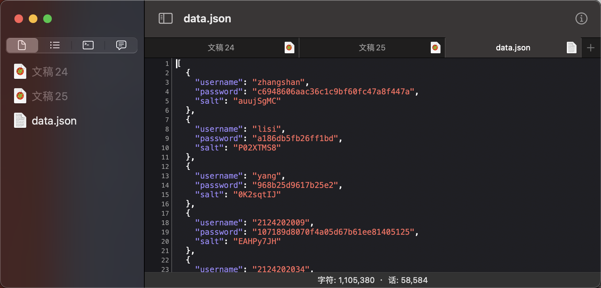
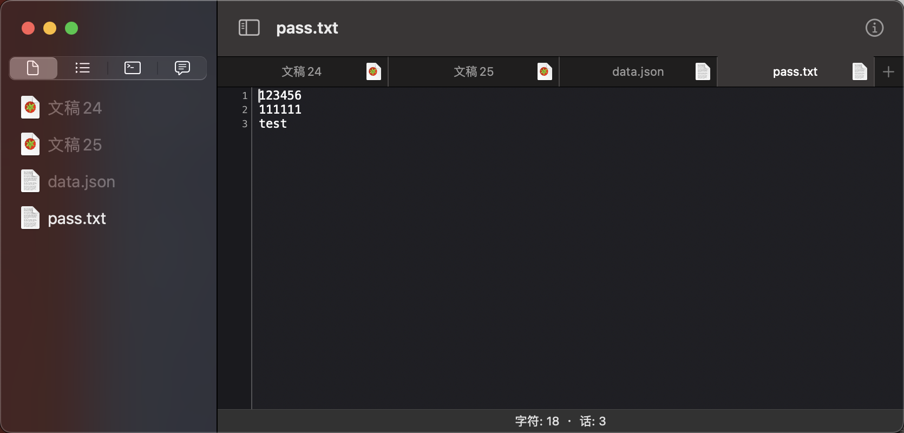

## 场景
有sqli的端点，但是无法rce以及进一步获得权限，我们可以尝试通过sqli获取凭据从而获得用户级权限

数据库中`password`字段是加密的，通过查看源码发现密码使用PBE进行加密，关键是用明文密码作为对称加密key的一个环节，所以没办法直接逆向解密，但是可以离线爆破。




## 实现过程
过程非常简单，直接捞出加密过程，然后通过sqli将数据库中的`用户名`、`加密后的密码`、`salt`取出来，然后直接用字典跑就行～

先取出对应的数据，放到根目录下的`data.json`，然后准备一个字典，放到根目录下的`pass.txt`


然后直接:
```
java -jar JeecgBoot-offline-brute.jar
```


